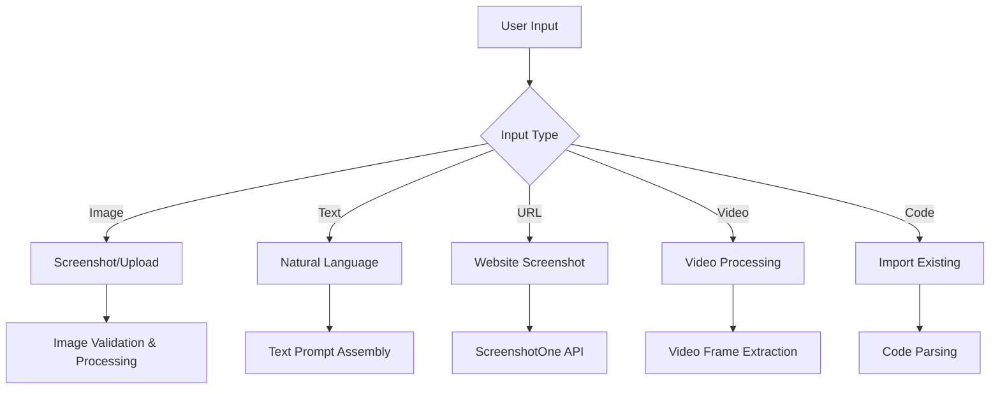

# Screenshot-to-Code Application: Comprehensive Architecture Analysis

## Overview

Screenshot-to-Code is a sophisticated AI-powered application that converts screenshots, mockups, Figma designs, and even natural language descriptions into functional, clean code. The application uses cutting-edge AI models (Claude, GPT-4o, Gemini) to generate multiple code variants simultaneously, providing users with options and ensuring high-quality output.

## 🏗️ System Architecture

### **High-Level Architecture**
```
┌─────────────────┐    WebSocket    ┌──────────────────┐    HTTP    ┌─────────────────┐
│   React Frontend│◄───────────────►│  FastAPI Backend │◄──────────►│   AI Providers  │
│                 │                 │                  │            │ OpenAI/Anthropic│
│ - TypeScript    │                 │ - Python         │            │ /Gemini        │
│ - Zustand       │                 │ - Poetry         │            └─────────────────┘
│ - Tailwind      │                 │ - Async/Await    │
│ - Vite          │                 │ - Pipeline Pattern│
└─────────────────┘                 └──────────────────┘
```

## 🔧 Technical Stack

### **Frontend**
- **Framework**: React 18 + TypeScript
- **Build Tool**: Vite
- **State Management**: Zustand
- **Styling**: Tailwind CSS
- **UI Components**: Radix UI
- **Code Editor**: CodeMirror
- **Notifications**: React Hot Toast

### **Backend**
- **Framework**: FastAPI
- **Language**: Python 3.10+
- **Package Manager**: Poetry
- **API Communication**: WebSocket + HTTP
- **AI Integration**: OpenAI, Anthropic, Google Gemini clients
- **Architecture Pattern**: Middleware Pipeline

### **Supported Output Technologies**
- HTML + Tailwind CSS
- HTML + CSS
- React + Tailwind
- Bootstrap
- Vue + Tailwind (Beta)
- Ionic + Tailwind (Beta)
- SVG (Beta)

## 🧠 AI Model Integration

### **Supported Models & Capabilities**

#### **Primary Models (Recommended)**
1. **Claude 3.7 Sonnet (2025-02-19)**
   - Best overall performance
   - Thinking mode with 10,000 budget tokens
   - 20,000 max tokens output
   - Different models for create vs update operations

2. **GPT-4.1 (2025-04-14)**
   - Latest OpenAI model
   - High token limits (20,000)
   - Reasoning effort set to "high"

3. **GPT-4o (2024-11-20)**
   - Reliable performance
   - 16,384 max tokens
   - Wide compatibility

#### **Specialized Models**
- **O1 Series**: Non-streaming, reasoning-focused
- **Claude 4 Series**: Thinking mode with budget tokens
- **Gemini 2.0 Flash**: Vision capabilities, thinking budgets

### **Model Selection Strategy**
- **API Key Availability**: Automatically selects based on available keys
- **Input Mode**: Different models for image vs text vs video
- **Generation Type**: Different models for creation vs updates
- **Fallback Chain**: Graceful degradation if primary models fail

## 🔄 Pipeline Flow: From Screenshot to Code

### **1. Input Processing**


### **2. Prompt Engineering**
The application uses sophisticated prompt engineering with different templates for each stack:

```python
# Example HTML+Tailwind System Prompt (simplified)
"""
You are an expert Tailwind developer
You take screenshots of a reference web page from the user, and then build single page apps 
using Tailwind, HTML and JS.

- Make sure the app looks exactly like the screenshot.
- Pay close attention to background color, text color, font size, font family, 
  padding, margin, border, etc. Match the colors and sizes exactly.
- Use the exact text from the screenshot.
- Do not add comments in the code such as "<!-- Add other navigation links as needed -->"
- Repeat elements as needed to match the screenshot.
- For images, use placeholder images from https://placehold.co
"""
```

### **3. Multi-Variant Generation Pipeline**

#### **Pipeline Architecture (Middleware Pattern)**
```python
# Main Pipeline Stages
pipeline = Pipeline()
pipeline.use(WebSocketSetupMiddleware())           # WebSocket connection
pipeline.use(ParameterExtractionMiddleware())      # Parse & validate input
pipeline.use(StatusBroadcastMiddleware())          # Notify frontend
pipeline.use(PromptCreationMiddleware())           # Assemble AI prompts
pipeline.use(CodeGenerationMiddleware())           # Generate code variants
pipeline.use(PostProcessingMiddleware())           # Cleanup & logging
```

#### **Parallel Variant Generation**
- Generates 3-4 code variants simultaneously
- Each variant uses a different AI model or configuration
- Independent error handling per variant
- Real-time streaming of results to frontend

### **4. WebSocket Communication Protocol**

#### **Message Types**
```typescript
type WebSocketResponse = {
  type: "chunk" | "status" | "setCode" | "error" | 
        "variantComplete" | "variantError" | "variantCount";
  value: string;
  variantIndex: number;
};
```

#### **Communication Flow**
1. **Handshake**: Frontend sends generation parameters
2. **Status Updates**: Backend broadcasts generation progress
3. **Chunk Streaming**: Real-time code generation chunks
4. **Variant Management**: Independent completion/error handling
5. **Image Generation**: Post-processing with DALL-E/Flux
6. **Final Assembly**: Complete code delivery

## 🎨 Frontend Architecture Deep Dive

### **State Management (Zustand Stores)**

#### **App Store** (`app-store.ts`)
```typescript
// Global UI state
interface AppState {
  appState: "INITIAL" | "CODING" | "CODE_READY";
  updateInstruction: string;
  updateImages: string[];
  selectAndEditMode: boolean;
}
```

#### **Project Store** (`project-store.ts`)
```typescript
// Project-specific data with Git-like versioning
interface ProjectState {
  inputMode: "image" | "video" | "text";
  referenceImages: string[];
  commits: Commit[];
  head: string | null;
  // Variant management per commit
  variants: VariantStatus[];
}
```

### **Core Components**

#### **Sidebar** (Left Panel)
- Generation settings (stack, model selection)
- Multi-variant display with status indicators
- Update interface with image upload
- Git-like commit history
- Reference image display

#### **Preview Pane** (Right Panel)
- Tabbed interface (Desktop/Mobile/Code views)
- Live iframe preview with responsive scaling
- Syntax-highlighted code editor
- Download functionality
- Select-and-edit feature

### **Advanced Features**

#### **Variant System**
```typescript
interface Variant {
  code: string;
  status: "generating" | "complete" | "error" | "cancelled";
  error?: string;
}
```
- Users can switch between variants (Alt+1-9)
- Real-time status updates per variant
- Independent error handling

#### **Commit & History System**
```typescript
interface Commit {
  hash: string;
  type: "ai_create" | "ai_edit" | "code_create";
  parentHash: string | null;
  variants: Variant[];
  inputs: PromptContent | null;
}
```
- Git-like versioning system
- Branching and rollback capabilities
- Visual history representation

## 🔧 Configuration & Setup

### **Environment Variables**

#### **Required for AI Models**
```env
# At least one is required
OPENAI_API_KEY=sk-your-openai-key
ANTHROPIC_API_KEY=your-anthropic-key
GEMINI_API_KEY=your-gemini-key
```

#### **Optional Configuration**
```env
# Image Generation (optional)
REPLICATE_API_KEY=your-replicate-key

# Development
MOCK=true                    # Mock AI responses
IS_DEBUG_ENABLED=true        # Debug logging
DEBUG_DIR=/path/to/debug     # Debug output directory

# Production
IS_PROD=true                 # Production mode
BACKEND_PORT=7001            # Custom backend port
```

### **Development Setup**

#### **Backend Setup**
```bash
cd backend
echo "OPENAI_API_KEY=sk-your-key" > .env
echo "ANTHROPIC_API_KEY=your-key" > .env
poetry install
poetry shell
poetry run uvicorn main:app --reload --port 7001
```

#### **Frontend Setup**
```bash
cd frontend
npm install
npm run dev
# Access: http://localhost:5173
```

#### **Docker Setup**
```bash
echo "OPENAI_API_KEY=sk-your-key" > .env
docker-compose up -d --build
# Access: http://localhost:5173
```

## 🔍 Key Features & Capabilities

### **Multi-Modal Input Support**
1. **Image Mode**: Screenshot/image upload with drag-and-drop
2. **Video Mode**: Video processing (3-4 minutes processing time)
3. **Text Mode**: Natural language descriptions
4. **URL Mode**: Website screenshots via ScreenshotOne API
5. **Code Import**: Import existing code for enhancement

### **Select-and-Edit Feature**
- Click elements in preview to target specific updates
- Available for GPT-4o and Claude 3.5 Sonnet
- Works with HTML/Tailwind and HTML/CSS stacks
- Provides precise element context to AI

### **Image Generation Integration**
- **DALL-E 3**: High-quality image generation
- **Flux (Replicate)**: Alternative image generation
- Automatic placeholder replacement
- Intelligent alt-text generation for accessibility

### **Quality Assurance Features**
- Multiple variant generation for quality comparison
- Model-specific optimizations
- Comprehensive error handling
- Graceful degradation for failed generations

## 🧪 Testing & Development

### **Testing Structure**
```bash
# Frontend tests
cd frontend && yarn test

# Backend tests  
cd backend && poetry run pytest

# All tests
npm test  # From root directory
```

### **Mock Development Mode**
```bash
# Backend mock mode (no AI API calls)
MOCK=true poetry run uvicorn main:app --reload --port 7001
```

## 📊 Performance Characteristics

### **Generation Times**
- **Image Mode**: 15-30 seconds per variant
- **Text Mode**: 10-20 seconds per variant
- **Video Mode**: 3-4 minutes (Claude 3 Opus only)
- **Updates**: 10-15 seconds per variant

### **Resource Usage**
- **Memory**: ~200MB backend, ~100MB frontend
- **Network**: Real-time WebSocket streaming
- **Storage**: Temporary image/video processing

## 🔒 Security Considerations

### **API Key Management**
- Environment variable storage
- Frontend settings dialog (optional)
- No server-side API key storage
- Production mode restrictions

### **Input Validation**
- Image format validation
- URL normalization and validation
- Prompt content sanitization
- File size limitations

## 🚀 Deployment Options

### **Development**
- Local development with hot reload
- Mock mode for API-free testing
- Debug logging and file output

### **Docker**
- Multi-container setup (frontend + backend)
- Environment variable injection
- Production-ready configuration

### **Cloud Deployment**
- FastAPI backend deployment
- React SPA frontend hosting
- WebSocket support requirements
- Environment-specific configurations

## 🎯 Use Cases & Applications

### **Primary Use Cases**
1. **Rapid Prototyping**: Convert designs to working code quickly
2. **Legacy Modernization**: Update old designs with modern frameworks
3. **Design-to-Code Workflow**: Bridge design and development teams
4. **Learning Tool**: Understand how designs translate to code

### **Target Frameworks**
- **HTML/Tailwind**: Modern utility-first CSS
- **React**: Component-based applications
- **Bootstrap**: Traditional responsive design
- **Vue/Ionic**: Mobile and web applications

## 📈 Future Extensibility

### **Model Integration**
- Easy addition of new AI providers
- Model-specific optimization capabilities
- Custom prompt engineering per model

### **Output Formats**
- Extensible stack system
- Custom template support
- Framework-specific optimizations

### **Feature Expansion**
- Additional input modes
- Enhanced editing capabilities
- Team collaboration features
- API for external integration

---

This architecture analysis provides a comprehensive understanding of the Screenshot-to-Code application, from its sophisticated AI integration and multi-variant generation system to its user-friendly frontend and robust backend infrastructure. The application represents a mature, production-ready system for AI-powered code generation with advanced features like version control, real-time collaboration, and multi-modal input support.